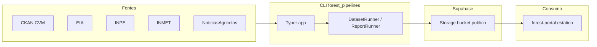

# Arquitetura

## Visão atual

Arquitetura em **pipeline offline orientado a CLI**: não há servidor HTTP no repositório. O fluxo é **fonte aberta → download/cache local → upload Supabase Storage → manifest JSON público** (e, para relatórios, JSON derivado + opcional texto LLM).

## Camadas

| Camada | Responsabilidade |
| --- | --- |
| **CLI** (`cli.py`) | Parsing de comandos, orquestração, upload de manifest após `sync` (com exceção documentada). |
| **Settings** (`settings.py`) | Carrega `.env`, resolve `root` a partir do **diretório pai** de `config_path`, cria diretórios `data`, `logs`, `docs`. |
| **Registries** | Mapa string → função `sync` / `build_package` / `run_audit`. |
| **Dataset runners** | Lógica por fonte; leem YAML em `configs/datasets/<rel_path>.yml` (ver matriz em `04_frontend.md`). |
| **Storage** | Cliente Supabase Python; upload com retry (3 tentativas, backoff). |
| **Manifests** | `build_manifest()` estrutura JSON comum; runners podem estender. |
| **Reports** | Leem ZIPs locais, agregam com pandas, cache incremental no bucket, opcional Groq. |
| **Audits** | Somente leitura local + escrita em `docs/audits/`. |

## Fluxo de dados (sync)

Comportamento inferido a partir de `src/forest_pipelines/cli.py` e runners típicos (ex.: `datasets/cvm/fi_inf_diario.py`):

1. `load_settings(config_path)` → `load_dotenv()`, resolve paths, lê `supabase.bucket_open_data_env` e obtém nome do bucket via `os.getenv`.
2. `get_logger(logs_dir, dataset_id)` → arquivo em `logs/<dataset_id>/YYYY/MM/YYYY-MM-DD.log` + stdout.
3. `SupabaseStorage.from_env` → exige `SUPABASE_URL` e `SUPABASE_SERVICE_ROLE_KEY`.
4. `get_dataset_runner(dataset_id)` → função registrada.
5. Runner: carrega YAML, baixa para `data/…`, faz `upload_file` / `upload_bytes`, retorna dict manifest.
6. CLI remove `_cli_skip_manifest_upload` se presente; se não skip, serializa JSON e `upload_bytes` em `{bucket_prefix}/manifest.json`.

**Caso especial (`noticias_agricolas_news`):** o runner já envia snapshot versionado e `manifest.json` estável; retorna `_cli_skip_manifest_upload: True` para o CLI **não** duplicar o upload do manifest (`src/forest_pipelines/datasets/noticias_agricolas/sync.py`).

## Fluxo build-report

1. Mesmos passos 1–3 (storage obrigatório).
2. `get_report_runner(report_id)` → ex.: `bdqueimadas_overview.build_package`.
3. Builder: carrega `configs/reports/<id>.yml`, lê ZIPs em `data/…`, usa storage para cache incremental, gera pacote com `generated_report` e `live_report`.
4. `publish_report_package` (`reports/publish/supabase.py`) envia vários JSONs e manifest do report.

## Fluxo audit-dataset

1. `load_settings`, `get_logger`.
2. **Não** instancia `SupabaseStorage` no CLI — auditoria é local.
3. `get_audit_runner` → escreve em `settings.docs_dir` (ex.: `docs/audits/inpe/bdqueimadas_focos/`).

## CLI — referência técnica

- **App Typer:** `app = typer.Typer(add_completion=False, no_args_is_help=True)` — sem completion; sem argumentos mostra ajuda.
- **Entry console:** `forest-pipelines = forest_pipelines.cli:app` em `pyproject.toml`.
- **Invocação alternativa:** `python -m forest_pipelines.cli` funciona após instalar o pacote (o módulo `cli.py` contém `if __name__ == "__main__": app()`).

### Comando `sync`

| Item | Valor |
| --- | --- |
| Nome Typer | `sync` |
| Argumento | `dataset_id: str` (obrigatório) |
| Opções | `--config-path` (default `configs/app.yml`), `--latest-months` (opcional, int) |
| Efeito de `--latest-months` | Passado ao runner; se `None`, o runner usa valor do YAML (ex.: CVM). Nem todos os datasets o utilizam (README: não aplica a `noticias_agricolas_news`). |

### Comando `build-report`

| Item | Valor |
| --- | --- |
| Nome Typer | `build-report` (kebab-case) |
| Argumento | `report_id` |
| Opções | `--config-path` |

### Comando `audit-dataset`

| Item | Valor |
| --- | --- |
| Argumento | `dataset_id` — **deve existir no registry de auditorias**, não no de datasets em geral |
| Opções | `--config-path` |

## Resolução de `root` e caminhos

Em `load_settings` (`settings.py`):

- `root = Path(config_path).resolve().parent.parent` — ou seja, **dois níveis acima** do arquivo de config. Para `configs/app.yml`, `root` é a raiz do repositório.
- Se `--config-path` apontar para outro lugar, `root` muda; todos os paths relativos (`data_dir`, `datasets_dir`, etc.) são relativos a esse `root`.

## Padrões utilizados

- **Registry pattern** para extensibilidade (dicionários `RUNNERS`).
- **Dataclasses** para configs carregadas de YAML.
- **Retries** em upload Storage.
- **Separação** portal vs pipelines (README).

## Problemas arquiteturais

1. **Dois identificadores por dataset:** ID do CLI/registry vs caminho relativo do YAML — duplicidade cognitiva; mitigação futura: gerar o path a partir do ID ou documentar tabela única (já feito em `04_frontend.md`).
2. **Service role para Storage:** simples para pipelines, porém chave poderosa; ver `11_security.md`.
3. **Relatórios pesados em memória:** pandas sobre ZIPs grandes — risco de OOM em runners pequenos (ver `05_backend.md`).

## Escalabilidade (alto nível)

- **CLI única thread** por processo; `noticias_agricolas` usa `ThreadPoolExecutor` limitado para HTTP.
- **GitHub Actions:** um job semanal; repositórios públicos costumam ter uso de Actions gratuito, mas políticas de billing evoluem — consulte [About billing for GitHub Actions](https://docs.github.com/billing/managing-billing-for-github-actions/about-billing-for-github-actions).
- **Gargalo de rede:** uploads sequenciais por item em muitos runners; EIA/CVM podem ser limitados por origem.

## Sugestões de melhoria (não implementadas)

1. Camada fina de **abstração de storage** (interface + implementação Supabase) para testes e troca de backend.
2. **Workflow matrix** ou job por dataset com `workflow_dispatch` inputs para operação explícita.
3. **Empacotar dados** em formatos colunar no cache (Parquet já depende indiretamente via pyarrow) para relatórios maiores.
